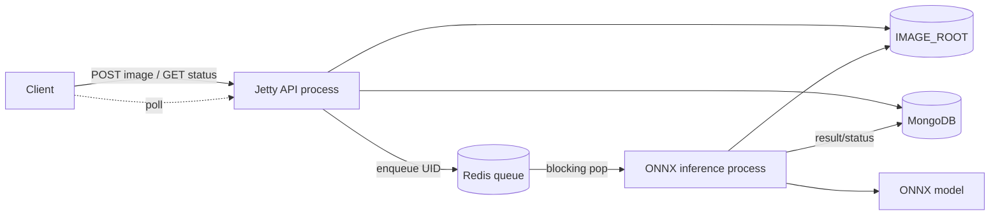
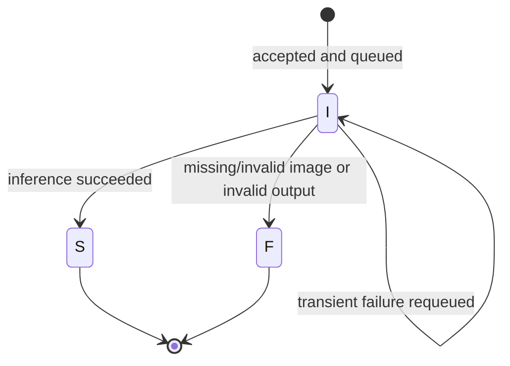

# Captcha Service

[](LICENSE)
[](https://openjdk.org/projects/jdk/17/)
[](https://maven.apache.org/)
[](https://github.com/SanyumCode/captcha-service/actions/workflows/ci.yml)

Captcha recognition is compute-heavy and should not hold an HTTP request open while
inference runs. Captcha Service separates ingestion/status APIs from ONNX inference,
using Redis as a work queue and MongoDB as the durable state store. The public project
entry is [aisupercode.site](https://aisupercode.site). Model training and artifacts live
in [captcha-crnn](https://github.com/SanyumCode/captcha-crnn); no model is bundled here.

## Features

- Asynchronous POST/poll API with stable task UIDs
- Separate Jetty API and ONNX inference processes
- PNG, JPEG, and GIF signature validation with bounded Base64 payloads
- MongoDB task state plus Redis blocking queue
- Three-stage write/retry/compensation flow
- Environment-only runtime configuration with safe loopback defaults
- Redis TLS through the JVM truststore or an explicit CA (never trust-all)
- Rolling, process-specific Log4j2 logs
- Java 17, Maven Wrapper, JUnit 5, and GitHub Actions CI

## Architecture





`I`, `S`, and `F` are the persisted internal states: initialized, succeeded, and failed.
See [docs/architecture.md](docs/architecture.md) for boundaries and failure behavior.

## Repository layout

```text
.github/workflows/ci.yml   Maven test/package CI
.mvn/                     Maven Wrapper metadata
docs/                     Architecture and API reference
src/main/java/             API, persistence, queue, and inference code
src/main/resources/        Logging configuration
src/test/java/             Offline unit tests
.env.example               Placeholder-only configuration template
```

## Quick start

Prerequisites: Java 17, Docker (for local data services), and an ONNX model compatible
with the linked CRNN repository.

```bash
# Linux/macOS
cp .env.example .env
./mvnw clean package

# Windows PowerShell
Copy-Item .env.example .env
.\mvnw.cmd clean package
```

`.env` is a template aid only; Java does not load it automatically. Export the values
with your process manager, shell, container runtime, or IDE. Never commit `.env`.

## Configuration

| Variable | Safe local default | Purpose |
|---|---|---|
| `MONGO_URI` | `mongodb://localhost:27017` | MongoDB connection URI; inject credentials at runtime |
| `MONGO_DATABASE` | `captcha` | Database name |
| `REDIS_HOST` | `localhost` | Redis host |
| `REDIS_PORT` | `6379` | Redis port |
| `REDIS_PASSWORD` | empty | Redis password; use a secret store outside local development |
| `REDIS_TLS` | `false` | Enable TLS when `true` |
| `REDIS_CA_PATH` | empty | PEM CA path; empty uses the JVM default truststore |
| `IMAGE_ROOT` | `data/images` | Private image storage root |
| `HTTP_HOST` | `127.0.0.1` | Jetty bind address; loopback by default |
| `HTTP_PORT` | `8080` | Jetty port |

## Prepare MongoDB and Redis

For disposable loopback-only local services:

```bash
docker run -d --name captcha-mongo -p 127.0.0.1:27017:27017 mongo:7
docker run -d --name captcha-redis -p 127.0.0.1:6379:6379 redis:7-alpine
```

Create a MongoDB user record before calling the API. The current schema stores `name`,
integer `_id`, and `apiK` in the `Users` collection. Provision users with an
administrative tool; do not expose user creation publicly. Production deployments must
enable authentication, network ACLs, backups, and Redis TLS/ACLs.

## Build and run

```bash
./mvnw test
./mvnw package
```

The package phase produces independent executable assemblies under `target/`.

```bash
# API process (starts immediately)
java -jar target/captcha-service-1.0.0-SNAPSHOT-server.jar

# Inference process; then enter 1 at its prompt to start workers
java -jar target/captcha-service-1.0.0-SNAPSHOT-inference.jar /secure/path/model.onnx 4
```

The model path is a runtime dependency and must not be committed. To expose the service,
place a TLS reverse proxy in front of Jetty and deliberately set `HTTP_HOST`; do not
expose the default local data services.

## API examples

Submit an image (the example value is a tiny placeholder, not a useful CAPTCHA):

```bash
curl -X POST 'http://127.0.0.1:8080/captcha/type1' \
  -H 'Content-Type: application/json' \
  --data '{
    "user": "demo-user",
    "api_key": "replace-with-your-api-key",
    "imgBase64": "iVBORw0KGgo="
  }'
```

```json
{"ok":true,"uid":"a1b2c3d4e5"}
```

Poll the result (URL-encode all values):

```bash
curl --get 'http://127.0.0.1:8080/captcha/get' \
  --data-urlencode 'user=demo-user' \
  --data-urlencode 'apiKey=replace-with-your-api-key' \
  --data-urlencode 'uid=a1b2c3d4e5'
```

```json
{"ok":true,"coded":"A7kP"}
```

Pending and failed requests return `{"ok":false,"cause":"..."}`. The current API
returns HTTP 200 for domain-level failures and HTTP 400/500 for malformed transport or
unexpected server errors. Full semantics are in [docs/api.md](docs/api.md).

## Three-stage compensation

Submission advances through: **(1)** write image, **(2)** persist MongoDB metadata,
**(3)** enqueue Redis work. Each stage is retried up to three times. If completion fails,
the API deletes the local image after stage 1 and deletes MongoDB metadata after stage 2.
Inference requeues a popped message after transient processing failure. This is
best-effort compensation, not a distributed transaction; operators should monitor and
reconcile orphaned files, rows, and queue items.

## Deployment, logs, and troubleshooting

- Run API and inference as separate, non-root services with independent restart policies.
- Mount `IMAGE_ROOT` into both processes at the same logical path.
- Inject credentials from a secret manager; never place them in command lines or logs.
- Logs are written beneath `logs/` using `server-*` and `inference-*` prefixes and are
  ignored by Git. Ship them with access controls and redact request data upstream.
- `User verification failed`: verify the provisioned user/key without printing the key.
- Tasks stay pending: check inference health, Redis connectivity, shared image storage,
  model compatibility, and queue depth.
- Redis TLS errors: verify hostname/SAN and JVM truststore, or set a readable explicit CA.
- Mongo timeouts: verify URI, ACLs, DNS, pool capacity, and server health; do not paste a
  credential-bearing URI into an issue.

## Security boundary

The service validates basic payload shape and image signatures, but it is not a complete
internet edge. Add HTTPS, request/body limits at the proxy, rate limiting, audit controls,
data retention, malware-aware isolation, and observability. The current API-key design is
retained for compatibility: keys are bearer secrets stored in MongoDB and one GET route
places the key in a query string, which intermediaries may log. Use only over HTTPS,
prevent URL logging, rotate keys, and prefer a private network until stronger auth lands.
OAuth 2.0 is **not implemented**.

See [SECURITY.md](SECURITY.md) before production use.

## Roadmap

- OAuth 2.0/OIDC with scoped, revocable credentials
- Hashed API-key storage and header-only authentication
- Non-interactive inference lifecycle and health/readiness endpoints
- Idempotency keys, dead-letter queue, and reconciliation tooling
- Metrics, tracing, rate limits, object storage, and retention automation
- Versioned API responses and stronger image decoding/sandboxing

## License

Licensed under the [MIT License](LICENSE). Third-party and model notices are in [NOTICE](NOTICE).
