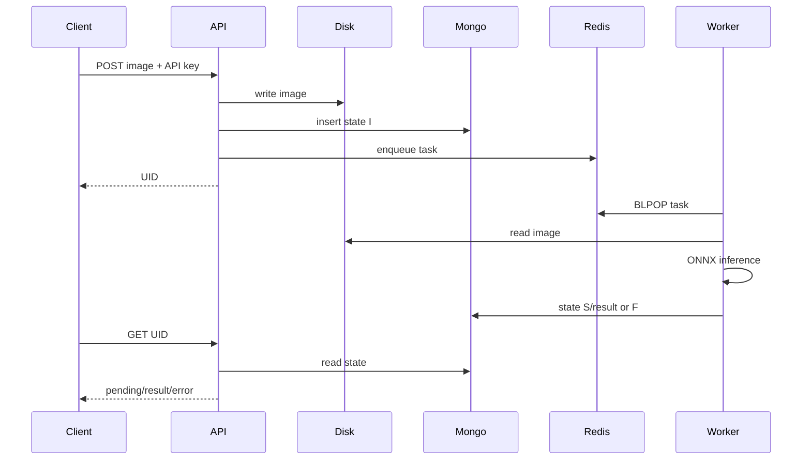

# Architecture

## Context

Captcha Service turns an interactive, compute-heavy recognition operation into an
asynchronous workflow. The HTTP process accepts work quickly; independently scalable
workers perform ONNX inference. MongoDB is the source of truth for user identity and task
state, Redis transports work identifiers, and a shared private filesystem contains image
bytes.

## Components

1. **Jetty API process** validates JSON, authenticates the legacy API key, checks the image
   signature, stores bytes/metadata, enqueues a compact work identifier, and serves polls.
2. **Inference process** blocks on the Redis queue, reads the shared image, runs the ONNX
   model, validates alphanumeric output, and updates MongoDB.
3. **MongoDB** stores `Users`, `Images`, and monotonic counters.
4. **Redis** carries at-least-once work messages on the `captcha` list.
5. **IMAGE_ROOT** is shared durable storage. Both processes must resolve it identically.

## Delivery and consistency

Redis list delivery is at least once at the application level: a worker requeues a message
when processing raises after pop. A crash between pop and requeue can still lose the queue
message. Submission retries each of the local-file, MongoDB, and Redis stages three times,
then executes reverse compensation for completed stages. Neither flow is atomic across
systems. Duplicate delivery should be harmless because result updates target the same user
and UID, but operators still need reconciliation and dead-letter controls for production.

## Trust boundaries

- Clients are untrusted. A reverse proxy should enforce HTTPS, request size, concurrency,
  and rate limits before Jetty.
- MongoDB, Redis, image storage, model file, and logs are trusted infrastructure and must
  be isolated with least-privilege identities.
- Redis TLS uses hostname validation plus either the JVM truststore or one explicit CA.
  There is no certificate-verification bypass.
- API keys are current compatibility credentials, not OAuth tokens. They are bearer secrets
  and the current persistence format is not hashed.

## State model

- `I`: accepted and awaiting/undergoing inference.
- `S`: inference completed and validated; `coded` contains the result.
- `F`: input/model result could not be processed.

Unknown or inconsistent states produce a generic server error. Future work should add
explicit timestamps, attempt counts, failure categories, a dead-letter state, and expiry.

## Scaling and operations

API instances are stateless except for their use of shared services. Inference concurrency
is selected at startup; CPU, native ONNX memory, and model thread behavior determine safe
limits. Horizontal workers may share the Redis list. Shared local storage becomes a scaling
constraint, so object storage is a planned evolution. Logs must never include credentials,
full request bodies, image bytes, or credential-bearing connection URIs.
